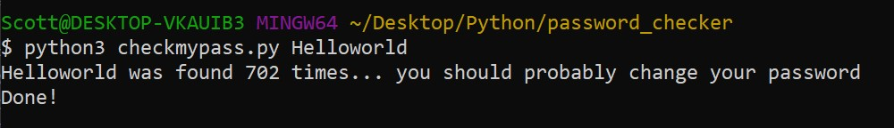

# Password Checker

## Description

    This is a project that I did with the Udemy course Complete Python Developer in 2022: Zero to Mastery. Taught by: 
*[Andrei Neagoie](https://www.udemy.com/course/complete-python-developer-zero-to-mastery/#instructor-1)*.

    Check if you need to make a stronger password, or if yours is still safe.

## Usage

    Once you have cloned the repository, you can run the following command:
    In the command line, type:

    `python3 checkmypass.py PASSWORD`

